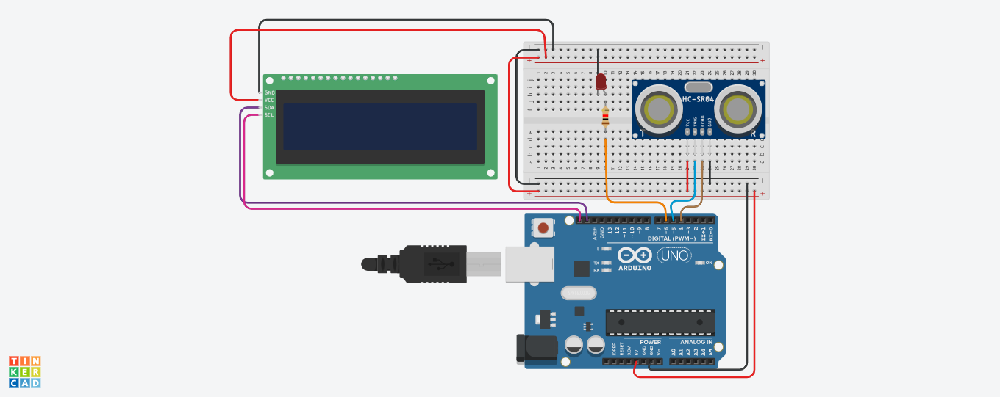

# Using ultrasonic sensors and LCD
## Ultrasonic sesnor
* Download zip files to obtain the library used in this example. 
* In your ardiuno IDE click include library under sketch.
* Add library as ZIP file and wait for installation.
* Include library. 
- [Zip file for LCD with I2C](https://www.arduino.cc/reference/en/libraries/liquidcrystal-i2c/)
- [Zip file for NewPing](https://www.arduino.cc/reference/en/libraries/newping/)
* You can obtain further functions and methods in the library through the link below.
- [NewPing funtions](https://bitbucket.org/teckel12/arduino-new-ping/wiki/Home)
- 

The ultrasonic sensor detects the distance and the distance is recorded and displayed in the LCD.
This can be used for various thing such as making radars, detecting obstacles, checking level of water in deep boreholes.
### Compiled by:
 - Barbra Gitonga 
 - [Github profile](https://github.com/BarbraGitonga)
 - [LinkedIn](https://www.linkedin.com/in/barbra-gitonga/)