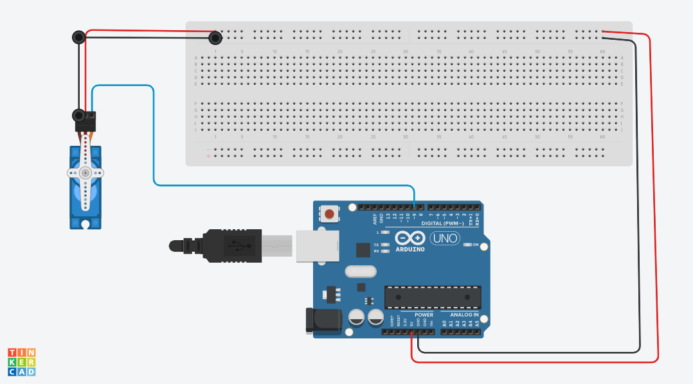

# Micro Servo Motors
* Download zip in the repository.
* Include library through add zip under sketch.
* After installation, include library.

[Micro servo zip file](https://www.arduino.cc/reference/en/libraries/servo/)

- This is use of a micro servo using loops. The micro servo can be used in a number of projects like making 
- You can access other methods from the link below.

[Micro servo functions](https://www.arduino.cc/reference/en/libraries/servo/)

### Contributer:
  - Barbra Gitonga 
 - [Github profile](https://github.com/BarbraGitonga)
 - [LinkedIn](https://www.linkedin.com/in/barbra-gitonga/)
 