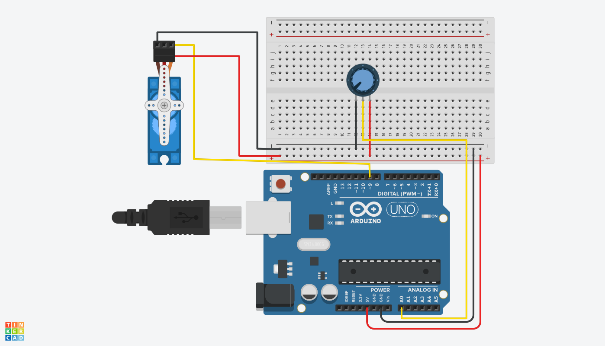

# Micro Servo Motors
## Servo motor with loops
- This is use of a micro servo using loops. The micro servo can be used in a number of projects like making 
- You can access other methods from the link below.
### Steps
1. Download zip in the repository.
2. Include library through add zip under sketch.
3. After installation, include library.

[Micro servo zip file](https://www.arduino.cc/reference/en/libraries/servo/)
[Micro servo functions](https://www.arduino.cc/reference/en/libraries/servo/)

### Requirements
-  A microservo motor
- 3 male-male jumper cables.

## Servo Motor with potentiometer
-Use the similar steps as above but inculde
### Requirements
-  A microservo motor
-  Arduino uno
-  jumper wires
-  breadboard
-  rotatory potentiometer (10kohm)

### Contributer:
  - [Barbra Gitonga](https://github.com/BarbraGitonga) 
  - [Balimwacha Bethuel](https://www.linkedin.com/in/balimwacha-betuel-76b560237/)
  - [Catherine Kabura](https://github.com/Kaburaa)

 