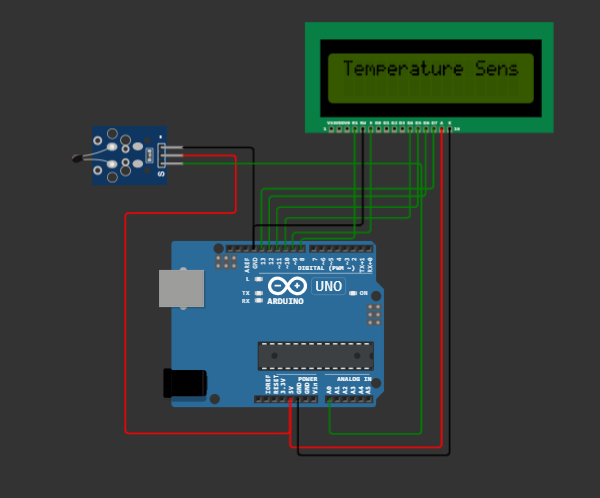

## Temperature Sensor with LCD
In this project a temperature is interfaced with arduino uno board. The output of the sensor is an analog voltage which is connected
to the analog pin A0 of the board. It is then cnverted to a digital signal by the ADC. This value is then converted to temperature equivalent by multiplying it with 0.48828125. This value is then displayed on the 2 * 16 lcd.

###### The circuit used is as shown below
