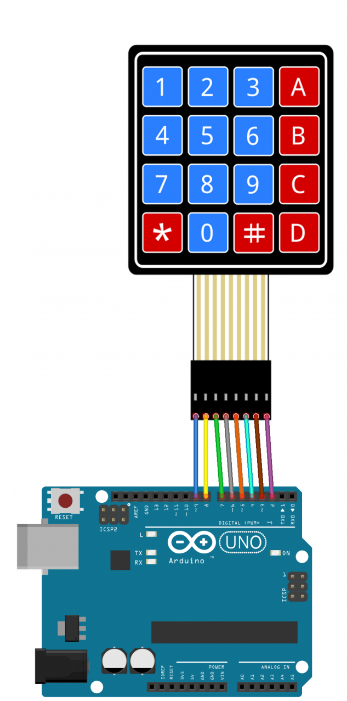
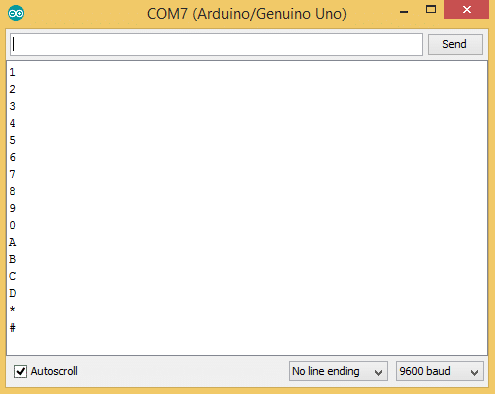

# simple keypad project 
We used a 4x4 matrix membrane keypad, there are usually other configuration such as 3x4 or even 1x4 but in this simple project we decided to use the 4x4 keypad with the arduino.
## What you need 
1. Arduino uno
2. 4x4 keypad
3. 8 female to male jumper wires
4. Arduino IDE installed 
## Steps 
* Download and install Arduino IDE from [here](https://www.arduino.cc/en/software)
* Download keypad library from within the arduino IDE. Navigate to Sketch > Include library > manage libraries and search for keypad, make sure it is the one written by Mark stanley 
* connect the pins of the keypad as shown then run the code in your IDE 

If set up correctly the outputs of the keypad should display on the serial monitor 

Success!
