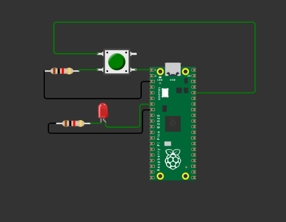

## PUSH BUTTON DOCUMENTATION

In this mini project a push button was put in a pull down resistor configuration as shown.

Initially the LED is HIGH.Pressing the pushbutton the LED goes LOW.Pressing again will make the LED go HIGH.

## Components Required

1.LED
2.2 Resistors
3.Pushbutton
4.Raspberry Pi Pico

Simulated using [Wokwa Software](https://wokwi.com/projects/333716666938557010)

## Collaborators
1.[Ian Kisali](https://github.com/iankisali)
2.[Boniface Kiarie](https://github.com/bonniekiarie)

