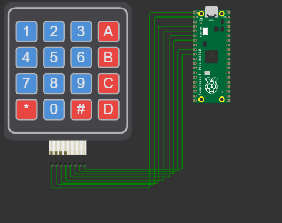

## INTERFACING KEYPAD WITH RASPBERRY PI PICO

In this documentation a 4 x 4 keypad was used as input to the Pico. The pressed key are then displayed on the screen

Simulated using [Wokwi Software](https://wokwi.com/projects/333806557676438099)

#### The circuit used is as shown below

## Collaborators
1. [Ian Kisali](https://github.com/iankisali)
2. [Bonface Kiarie](https://github.com/bonniekiarie)