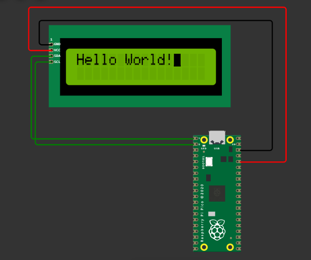

## LCD DISPLAY USING I2C PROTOCOL WITH RASPBERRY PICO

In this mini project a 2 x 16 i2c lcd module is connected to pico board.

The address of the lcd module was taken 0x27, which is the default for lcd displays.
The pin connection of the lcd module to the i2c module was as follows.
###### LCD PINS  CORRESPONDING I2C PIN
RS  P0
RW  P1
E   P2
Backlight   P3
D4-D7 P4-P7 

The circuit used is as shown below.

