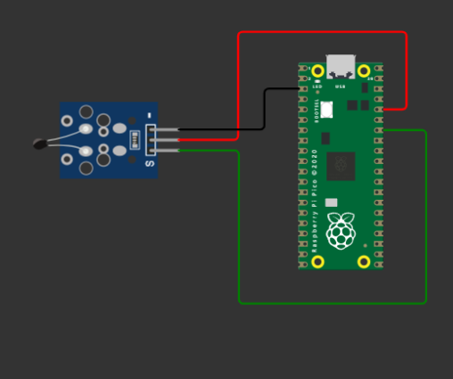

## Temperature Sensor with PICO

In this project an analog temperature sensor is connected to the pico at the
ADC pin 28. The analog voltage is converted to digital using ADC  then to celcius
equivalent. The value is then printed on the screen.

The circuit used is as shown below.

The simulation software used is [here](https://wokwi.com/projects/334975230837523027)