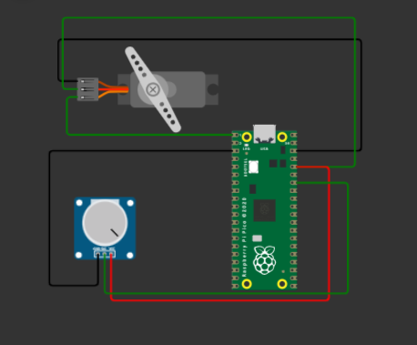

## Servo Motor control with pico

In this mini project a potentiometer is connected to the analog input of pico board. The position of the potentiometer determines the amount of voltage to the pico whuch is then converted to a digital value. This value is used to set the duty of the pwm wave thus controling the motor.

The circuit used is as shown below

The simulation software is [here](https://wokwi.com/projects/334989112299749972)