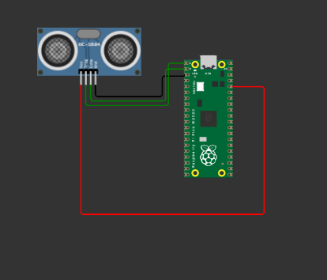

## ULTRASONIC DISTANCE SENSOR WITH PICO

in this documentation, a distance sensor(HC-SR04) is interfaced with the pico board.
The sensor can measure the distance to objects within range of 2cm to 4m.

##### The circuit use is as shown below

The simulation software used can be found [here](https://wokwi.com/projects/335150410580886098) 